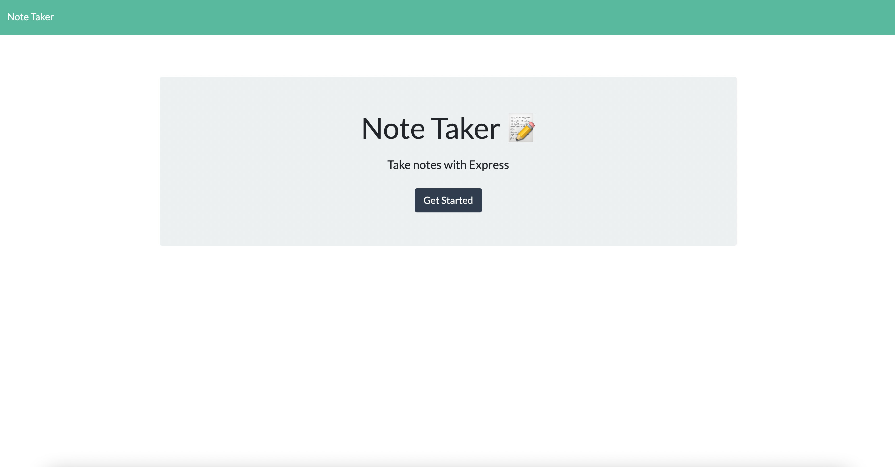
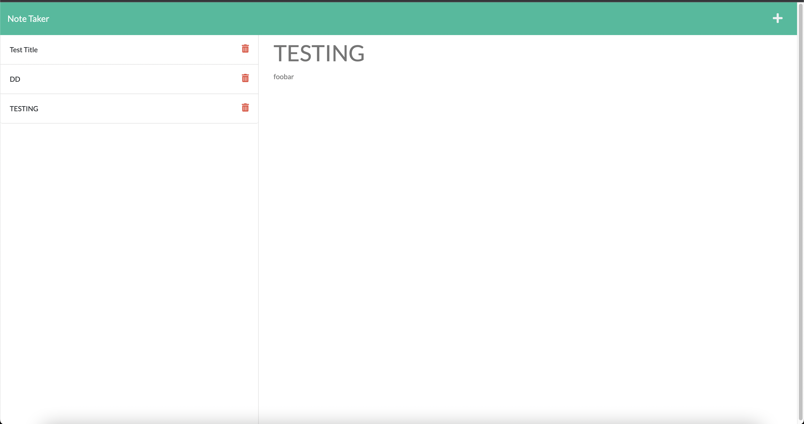

# Note-Taker-App

 
 

 ## [Deployed App](https://git.heroku.com/notetaker2208.git)

## Description
A small business owner wanted to be able to write and save notes so that owner can organize his thoughts and keep track of tasks he needed to complete.

The app was tailored to the clients specifications and ease of use. 

## Table of Contents
- [Installation](#installation)
- [Usage](#usage)
- [Credits](#credits)
- [Features](#features)
- [Test](#test)

## Installation
The appropriate packages consists of 
* npm init -y
* npm i 
* npm install express
* npm install uniqid

### Dependencies
* const express = require('express')

* const path = require('path')

* const fs = require('fs')

### Database 
A simple db.json file

## Usage
When the app is opened a landing page is presented with a link to a notes page.

When the notes page is clicked on the user is presented with a page of existing notes in the left hand column and empty fields to enter a new note title and the note’s text in the right-hand column.

Once a new note title and note’s text is entered a save icon appears in the navigation at the top of the page.

once the save icon is clicked the new note entered is saved and appears in the left-hand column with the other existing notes

When the existing note in the list is clicked in the left-hand column and that note appears in the right-hand column.

When the write icon is clicked on in the navigation at the top of the page I am presented with empty fields to enter a new note title and the note’s text in the right-hand column

### Video

### Screenshot 1 - Home

### Screenshot 2 - Notes

## Credits

https://guides.github.com/features/mastering-markdown/

https://www.digitalocean.com/community/tutorials/js-filter-array-method

https://www.npmjs.com/package/uniqid

https://nodejs.dev/learn/writing-files-with-nodejs

## Features
Take notes and save them or delete them.

## How to Contribute
Add a comment prior to contribution

## Tests
No testing on this app

## Questions
### Contact:
Github: [https://github.com/simpmind](https://github.com/simpmind)

Email: <tengfai97@gmail.com> 